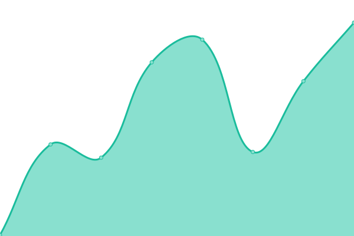
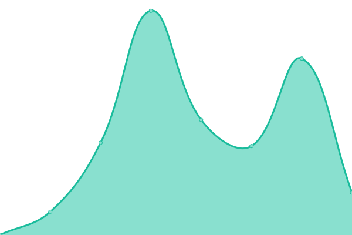

# [📈 Live Status](https://up.buck.fyi): <!--live status--> **🟩 All systems operational**

This repository contains the open-source uptime monitor and status page for [Buck Tower](https://bucktower.net/), powered by [Upptime](https://github.com/upptime/upptime).

With [Upptime](https://upptime.js.org), you can get your own unlimited and free uptime monitor and status page, powered entirely by a GitHub repository. We use [Issues](https://github.com/bucktower/upptime/issues) as incident reports, [Actions](https://github.com/bucktower/upptime/actions) as uptime monitors, and [Pages](https://up.buck.fyi) for the status page.

<!--start: status pages-->
<!-- This summary is generated by Upptime (https://github.com/upptime/upptime) -->
<!-- Do not edit this manually, your changes will be overwritten -->
<!-- prettier-ignore -->
| URL | Status | History | Response Time | Uptime |
| --- | ------ | ------- | ------------- | ------ |
|  [Who Is Buck Tower?](https://whoisbucktower.com) | 🟩 Up | [who-is-buck-tower.yml](https://github.com/bucktower/upptime/commits/HEAD/history/who-is-buck-tower.yml) | 

 278ms
     
 | 

<a href="https://up.buck.fyi/history/who-is-buck-tower">100.00%</a>
    

|  [Buck Tower](https://bucktower.net) | 🟩 Up | [buck-tower.yml](https://github.com/bucktower/upptime/commits/HEAD/history/buck-tower.yml) | 

 132ms
     
 | 

<a href="https://up.buck.fyi/history/buck-tower">100.00%</a>
    

|  [Andrew Tower](https://andrewtower.com) | 🟩 Up | [andrew-tower.yml](https://github.com/bucktower/upptime/commits/HEAD/history/andrew-tower.yml) | 

 284ms
     
 | 

<a href="https://up.buck.fyi/history/andrew-tower">100.00%</a>
    

|  [Buck.FYI](https://buck.fyi) | 🟩 Up | [buck-fyi.yml](https://github.com/bucktower/upptime/commits/HEAD/history/buck-fyi.yml) | 

 624ms
     
 | 

<a href="https://up.buck.fyi/history/buck-fyi">100.00%</a>
    

|  [Buck.Band](https://buck.band) | 🟩 Up | [buck-band.yml](https://github.com/bucktower/upptime/commits/HEAD/history/buck-band.yml) | 

 805ms
     
 | 

<a href="https://up.buck.fyi/history/buck-band">100.00%</a>
    

|  [Buck.Fun](https://buck.fun) | 🟩 Up | [buck-fun.yml](https://github.com/bucktower/upptime/commits/HEAD/history/buck-fun.yml) | 

 460ms
     
 | 

<a href="https://up.buck.fyi/history/buck-fun">100.00%</a>
    

<!--end: status pages-->

[**Visit our status website →**](https://up.buck.fyi)

## 📄 License

- Powered by: [Upptime](https://github.com/upptime/upptime)
- Code: [MIT](./LICENSE) © [Buck Tower](https://bucktower.net/)
- Data in the `./history` directory: [Open Database License](https://opendatacommons.org/licenses/odbl/1-0/)
